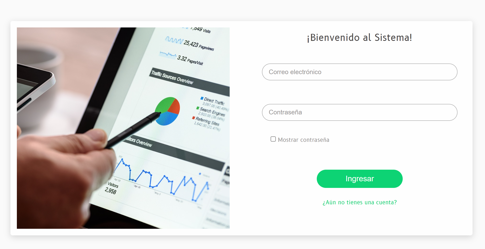
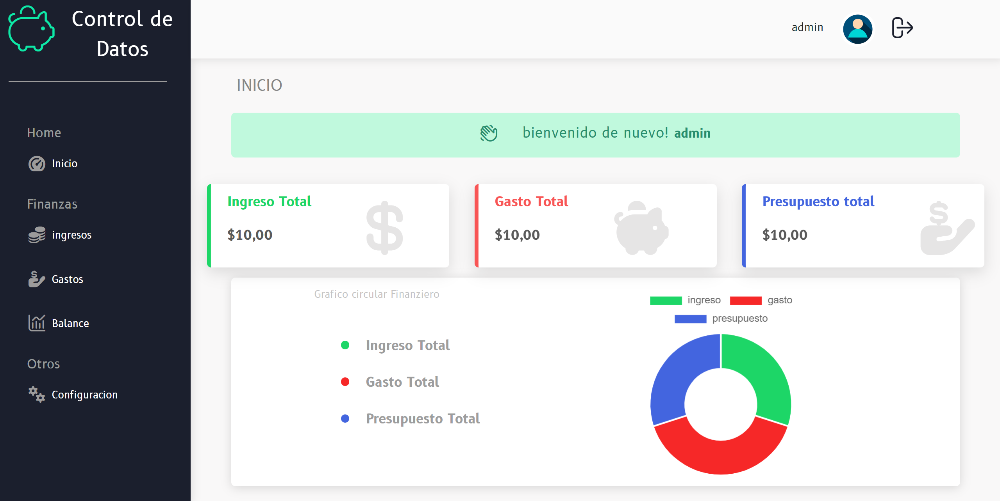

# EconomíaPersonal - Sistema de Finanzas

Este es un sistema para gestionar tus gastos e ingresos de manera eficiente.

## Objetivos

- Mantener un control adecuado de tus finanzas ✅
- Evaluar tus ingresos y egresos 📊
- Establecer metas de presupuesto 📑
- Tener tus finanzas bajo control 📗

## Modo de Uso

1. Clona el repositorio
2. Instala la base de datos desde el archivo `db_finanzas.sql` ubicado en la carpeta `database`.
3. Configura las credenciales de tu servidor local (usuario y contraseña) en el archivo `conexion.php`, ubicado en la carpeta `Modelo`.
4. Ejecuta el proyecto para comenzar a usarlo.

## Lenguajes Usados 💻

- **JavaScript** (Frontend): Para la interactividad dinámica en el frontend.
- **PHP** (Backend): Para el manejo de registros e inicio de sesión en el servidor.
- **HTML y CSS**: Para la estructura y diseño visual del sistema.
- **MySQL**: Para la gestión de la base de datos.

## Resumen

En este proyecto se emplean dos lenguajes de programación (para el frontend y backend) y una estructura de base de datos bien planificada. El sistema puede ser desplegado en un servidor en la nube.

## License

[MIT](https://choosealicense.com/licenses/mit/)

## Screenshots

